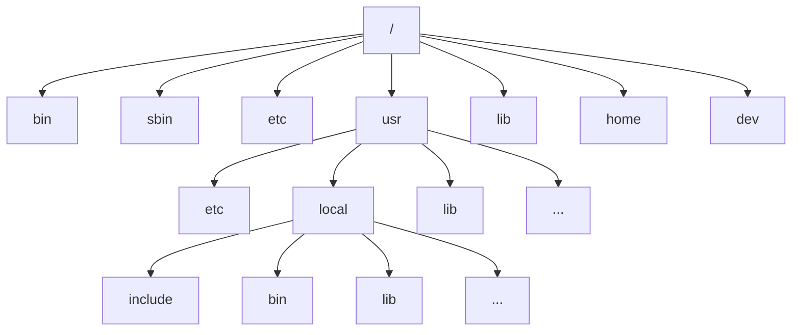
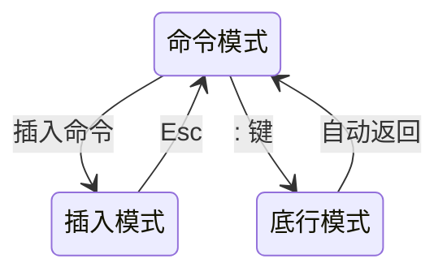
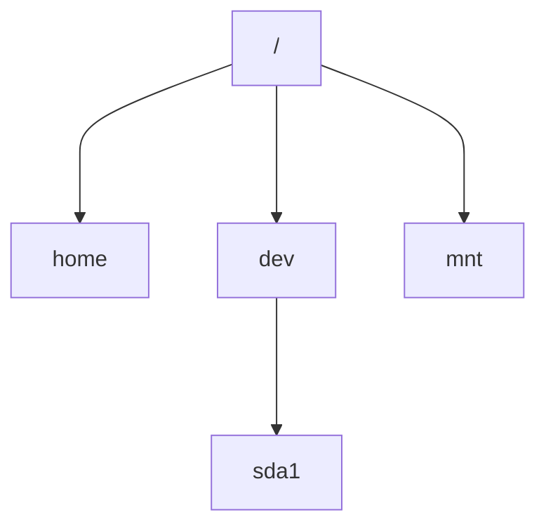
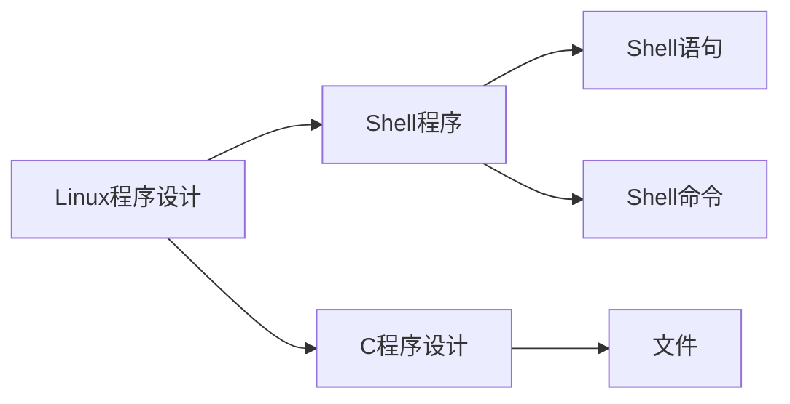

# 1 操作系统概述

## 1.1 操作系统的概念

#### 操作系统

操作系统是用户程序和系统应用程序与物理计算机之间的接口，是唯一管理和操作计算机的操作软件。

#### 计算机的组成

CPU（运算器、控制器）、存储器（主存储器、辅助存储器）、输入设备、输出设备

#### 操作系统的类型

进程：程序关于某个数据集合可并发的一次运行活动。

根据同时使用系统的用户数和系统同时运行的进程数的不同，可以把操作系统分成三类。

- 单用户、单进程系统：DOS、Windows 3.1
- 单用户、多进程系统：OS/2、Windows NT、95、98、2000
- 多用户、多进程系统：Linux、Unix、Windows XP、7、8、10

## 1.2 Linux 操作系统简介

Linus Torvalds 1991

#### Linux的特点

- 能在PC上实现Unix的全部特性，具有多任务、多用户和分时的能力

- 稳定

#### Linux的应用领域

教育领域、网络服务器领域、视频制作领域

#### 常见的发行版

Slackware、Red Hat、Debian

#### Red Hat Linux的优点

- 支持的硬件平台多（Intel、Alpha、Sparc）

- 优秀的安装接口（文本和图形两种安装接口，支持光盘、硬盘、FTP、HTTP服务器、NFS等方式安装）

- 独特的RPM（Red Hat Package Manager）升级方式

- 安全性能好

- 方便的系统管理接口

## 1.3  操作系统的安装

1. 选择安装模式
2. 测试安装介质
3. 选择语种、键盘、安装途径
4. 选择安装类型
5. **磁盘分区**
6. 配置引导装载程序
7. 配置TCP/IP网络
8. **设置主机名**
9. 防火墙配置
10. 语言支持的选择
11. 时区配置
12. **<u>设置根口令</u>**
13. 验证配置
14. **软件包的选择**
15. 准备安装
16. 安装软件包
17. 创建引导盘
18. 显卡配置
19. 显示器和定制
20. 安装完成

## 1.4  Linux 系统的构成

#### 系统构成

- 内核
- 用户界面
- 文件结构（**树状结构**）
- 实用工具

#### 文件结构



- dev：设备文件

- home：用户文件

# 2 Shell 及常用命令

## 2.1  Shell

Linux Terminal 也称为虚拟控制台，工作方式是字符命令行方式。

#### Shell 的种类

- bsh：第一个 Shell（Bourne Shell）
- csh：语法与C语言类似，因此得名
- ksh、tcsh、bash是上面两大主流的变种
- Linux 中常用的是 bash，其次是 csh

#### Shell 提示符

```bash
[用户账号@主机名 当前主目录]$
```

- 超级用户提示符：#
- bash：$
- csh：%

#### Shell 命令的基本格式

```bash
$ 命令名 [选项] <参数1> <参数2> ...
```

## 2.2  文件与目录结构

#### 文件

文件是 Linux 用来存储信息的基本结构，是被命名的存储在某种介质上的一组信息的集合。

Linux 中有三种基本的文件类型

- 普通文件：分为文本文件和二进制文件
- 目录文件：目录文件存储了一组相关文件的位置、大小等与文件相关的信息
- 设备文件：Linux 系统把每一个I/O设备都看成一个文件，与普通文件一样处理，这样可以使文件与设备的操作尽可能统一

#### 目录

Linux 系统以目录的方式来组织和管理系统中的所有文件

- 根：root
- 杈：directory

以根目录“/”为起点，所有其他的目录都由根目录派生而来

特殊目录：

- ”.“ 目录自己
- ”..“ 上一级目录
- 对于根目录，“.”和“..“都代表自己

工作目录：用户登陆到Linux系统后，每时每刻所处的目录就是工作目录或者当前目录

用户主目录：系统管理员创建用户的时候建立起来的目录，每个用户都有自己的主目录。使用符号~表示

#### 路径

路径是指从树形目录结构中的某个目录到某个文件的一条道路。此路径的主要构成是目录名称，中间用”/“分开。

- 绝对路径：从根目录开始的路径
- 相对路径：从用户工作目录开始的路径

#### 通配符

- 通配符 \*
- 通配符 ?
- 字符组模式 [ ] -
- 转义字符 \

## 2.3  目录和文件的基本操作

#### 文件查看和连接命令 cat

```bash
$ cat [option] <file>
$ cat >f1                    创建文件，然后可以输入文件，按Ctrl+Z表示输入结束
$ cat f1 f2 >f3            连接（合并）文件
```

#### 分屏显示命令 more

```bash
$ more [option] <file> ...
$ cat <file> |more
```

#### 复制命令 cp

```bash
$ cp [option] <source> <dest>
$ cp [option] <source> ... <dest>
$ cp -r                    文件夹及其所有子文件夹一起复制
$ cp f3 f4                同目录下复制
```

#### 移动或重命名命令 mv

```bash
$ mv [option] <source> <dest>
$ mv f1 f4                    重命名
$ mv f1 /disk1/stu1/.            移动
```

#### 删除命令 rm

```bash
$ rm [option] <name>
$ rm f1
$ rm -f <name>            不提示确认删除
```

去噪声不用 remove，用 attenuate。因为 remove 是彻底删除。

#### 创建目录命令 mkdir

```bash
$ mkdir [-p] <dirName>
```

#### 删除空目录命令 rmdir

```bash
$ rmdir [-p] <dirName>      必须是空文件夹
$ rm -r <dirName>           可以删除含有文件的目录
```

#### 改变路径 cd

```bash
$ cd <dirName>
$ cd /A/2A/3A
$ cd ../2A
```

#### 显示当前路径 pwd

```bash
$ pwd
```

#### 查看目录命令 ls

```bash
$ ls [option] [<name>]
$ ls a*     # 利用通配符筛选
$ ls -a     # 包含隐藏文件（显示所有文件）
$ ls -ltr   # 长列表，包含权限、时间等信息
            # -rwx 文件，后面是操作权限（读、写、执行）
            # drwx 目录
            # lrwx 符号链
$ ls >ff    # 定向符，将路径下的文件文件名保存到文件
$ ls -l
$ ll        # 相当于 ls -l
```

#### 查找文件或者目录命令 find

```bash
$ find [path] [expression]
```

#### 文件定位命令 locate/slocate

#### 链接 ln

```bash
$ ln [option] <source> <dest>            
```

#### 改变文件或目录时间的命令 touch

```bash
$ touch [option] <file1> [<file2> ...]
```

## 2.4  常用命令

#### 显示文字命令 echo

```bash
$ echo [-n] <string>
```

#### 显示日历命令 cal

```bash
$ cal [option] [[month] year]
$ cal 11 2021        显示2021年11月日历
```

#### 日期时间命令 date

```bash
$ date [option] [+FormatString]
# date <SetString>
```

#### 清除屏幕命令 clear

```bash
$ clear
```

#### 菜单命令 man

```bash
$ man [command]
$ man ls           查看 ls 命令的帮助
```

#### 启动软件

```bash
$ geoeast          启动软件（前台命令操作，独占终端）
$ geoeast &        后台启动软件
```

# 3 vi 编辑器

vi 编辑器：visual interface 是一种纯文本编辑器，不能用来排版

打开vi编辑器的方式（文件名不存在也可以）

```bash
$ vi fileName
$ vi fileName +4    # 表示希望进入之后处于第 4 行
$ vi fileName +     # 表示希望进入之后处于最后一行

```



## 3.1  命令模式

#### 移动光标

| 命令 | 功能                        |
| ---- | --------------------------- |
| h    | &#x2190;                    |
| j    | &#x2193;（按 + 也可以实现） |
| k    | &#x2191;（按 - 也可以实现） |
| l    | &#x2192;                    |

#### 替换命令

| 命令 | 功能                                  |
| ---- | ------------------------------------- |
| r    | r一次，换一个字符，然后恢复到命令模式 |
| R    | 一直替换，直到按Esc退出               |

#### 删除命令

| 命令   | 功能                                     |
| ------ | ---------------------------------------- |
| x      | x一次，删除一个字符                      |
| d$     | 删除光标后面的字符（包含光标所在的字符） |
| dd     | 删除整行                                 |
| 2dd    | 删除两行（包含当前行）                   |
| :2,4 d | 删除 2 至 4 行（这是一个底行命令）       |

#### 复制命令

先按o，用鼠标左键选中，再按中键粘贴到光标所在处（可能因系统原因无法复现）

#### 保存命令

保存文件：连按两次大写字母Z

#### 插入命令（进入插入模式，无需回车）

| 命令 | 功能                         |
| ---- | ---------------------------- |
| a    | 在光标所在字符后插入         |
| A    | 在当前行末尾插入             |
| i    | 在光标所在字符处插入         |
| I    | 在当前行开头插入             |
| o    | 在当前行下方插入一行         |
| O    | 在当前行上方插入一行         |
| s    | 删除当前光标的字符并开始插入 |
| S    | 删除当前行的内容开始插入     |

## 3.2  底行模式

#### 保存和退出文件

```
:w                 保存文件（如果文件不存在会询问）
:w <fileName>      保存文件
:w! <fileName>     强行保存
:q                 退出文件（询问是否保存）
:q!                强行不保存退出
:wq!               强行保存退出
```

#### 显示行号

```
:set nu    显示行号
:set nonu  隐藏行号
```

#### 复制和移动操作

```
:50,55 co 100      把 50 至 55 行复制到 100 行之后
:50,55 mv 100      把 50 至 55 行移动到 100 行之后
```

#### 移动光标

```
:1                 移动光标至第 1 行
```

#### 替换文本

```
:1,1 s/A/a         替换 1 至 1 行的第一个 A 为 a
:n1,n2 s/A/a
:n1,n2 s/A/a/g     全部替换
:n1,$ s/A/a/g      替换 n1 至末尾行的所有 A 为 a
```

#### 查找文本

```
:/A
```

光标过去，然后可以用n、N、空格切换到下一个结果

#### 把文件插入到光标所在处

```
:read <path>
:read file2
:read /home/cc/file2
```

#### 对其他文件进行编辑操作

```
:edit file2
```

# 4 硬件管理



| FAT32    | NTFS         |
| -------- | ------------ |
| 自动挂载 | 需要手动挂载 |

#### 挂载命令

```bash
# mount -t ext3 /dev/sda3 /mnt
$ cd /mnt
```

- `/mnt`下还可增加挂载名，例如`/mnt/c`
- 挂载目录必须先存在，否则mount无法正常执行

#### 卸载命令

```bash
# umount /mnt
```

执行时当前路径不能位于`/mnt`下

#### 查看所有设备文件名

```bash
$ fdisk -l
```

（WSL2子系统似乎不具备此功能？）

#### 创建文件系统

```bash
# mkfs
```

# 5 网络基本配置

配置网络接口可以使用三种不同的工具来完成：

- 网络接口配置程序 netconfig
- 图形配置工具
- 终端命令 ifconfig

```bash
$ ifconfig eth0 192.168.15.11 netmask 255.255.255.0
```

#### 网络接口的启动与禁用

网络控制程序 network

```bash
$ /etc/rc.d/init.d/network start|stop|restart
```

命令 ifconfig

```bash
$ ifconfig <设备名> [up|down]
```

#### 网络接口的查看

```bash
$ ifconfig
$ ifconfig eth0
```

#### 网络测试命令

```bash
$ ping [选项] <主机名或者IP地址>
$ ping 192.168.10.1
```

#### 显示数据包经过路由的命令

```bash
$ traceroute <目的主机IP或域名>
```

#### 管理路由表命令（不做要求）

```bash
$ route add|del -net <网络号> netmask <网络掩码> dev <设备名>
```

#### 远程登录命令

```bash
$ telnet <主机名或IP> 
$ rlogin <主机名或IP> 
```

#### FTP 上传下载命令

```bash
$ ftp <远程计算机IP> 
$ ftp 202.204.100.151
```

然后会要求输入另一台电脑的用户名和密码

登录成功后可以先看一下自己在什么目录下

```bash
> pwd
```

然后前往需要的目录（在对方计算机上）

```bash
> cd dir1
```

然后下载文件（文本文件）

```bash
> get file1
```

如果是二进制文件需要先执行 bin

```bash
> bin
> get file1
> get file2
```

如果需要下载多个文件，使用 mget 和通配符（会提示是否下载）

```bash
> mget f*
```

也可以关闭交互提问，就不会提示了

```bash
> propet
```

上传文件使用 put

```bash
> put file1
```

不退出ftp的情况下，改变本机的工作目录

```bash
> lcd dir2
```

退出 ftp

```bash
> quit
```

# 6 文件的备份和压缩

备份的重要性：防止丢失数据、节省存储空间

备份的介质：软盘、光盘、磁带、移动硬盘

## 6.1  归档（备份）命令 tar

```bash
$ tar [主选项+辅选项] 文件或者目录
```

#### 主选项

主选项是必选项，只能选一个，功能是告诉tar要做什么事情

| 选项   | 功能                                                                                                 |
| ------ | ---------------------------------------------------------------------------------------------------- |
| **-c** | 创建新的档案文件                                                                                     |
| -r     | 把要存档的文件追加到档案文件的尾部                                                                   |
| **-t** | 列出档案文件的内容，查看已经备份了哪些文件                                                           |
| -u     | 更新文件，用新增的文件取代原备份文件；&#x0D;&#x0A;如果找不到要更新的文件，则把它追加到备份文件的最后 |
| **-x** | 从档案文件中释放文件                                                                                 |

#### 辅助选项

辅选项是可选项，可以选多个，且无所谓顺序

| 选项   | 功能                                                             |
| ------ | ---------------------------------------------------------------- |
| -b     | 是为磁带机设定的；&#x0D;&#x0A;后跟数字说明区块大小，系统预设值20 |
| **-f** | 使用档案文件或者设备，通常是必选的                               |
| -m     | 在还原文件时，把所有文件的修改时间设定为现在                     |
| -M     | 创建多卷的档案文件，以便在几个磁盘中存放                         |
| **-v** | 详细报告tar处理的文件信息                                        |
| -w     | 每一步都要求确认                                                 |
| **-z** | 用gzip来压缩/解压缩文件                                          |

例1：将/home目录及其子目录下的所有文件或目录进行备份，备份文件名为usr.tar。

```bash
$ tar -cvf usr.tar /home
```

例2：将/home目录及其子目录全部做备份，并进行压缩，备份文件名为usr.tar.gz。

```bash
$ tar -czvf usr.tar.gz /home
```

例3：将备份文件usr.tar.gz还原并解压缩。

```bash
$ tar -xzvf usr.tar.gz
```

例4：查看usr.tar备份文件的内容，并以分屏模式显示在显示器上。

```bash
$ tar -tvf usr.tar |more
```

例5：用户在/dev/rmt0设备的磁带中创建一个备份文件，并将/home目录中所有的文件都拷贝到备份文件中。

```bash
$ tar -cvf /dev/rmt0 /home
```

要恢复设备磁带中的文件，可使用xf选项

```bash
$ tar -xvf /dev/rmt0
```

将当前目录下的子目录 dir1 和dir2，使用tar递归归档，使用gzip压缩归档的文件，并将压缩的归档文件保存到my.tar.gz中。

使用一条命令完成

```bash
$ tar -cvzf my.tar.gz dir1 dir2
```

使用两条命令完成

```bash
$ tar -cvf my.tar dir1 dir2
$ gzip my.tar
```

从压缩文件my.tar.gz中展开所有目录及文件

使用一条命令完成

```bash
$ tar -xvzf my.tar.gz
```

使用两条命令完成

```bash
$ gzip -d my.tar.gz
$ tar -xvf my.tar
```

创建多卷tar备份文件，当磁带已满时会提示放入新磁带

```bash
$ tar -cMf /dev/rmt0 /home
```

恢复几张盘上的档案，必要的时候会提示放入另一张磁盘

```bash
$ tar -xMf /dev/rmt0
```

## 6.2  压缩命令

### compress 命令

```bash
$ compress [选项] 文件列表
```

| 选项   | 功能                                                                       |
| ------ | -------------------------------------------------------------------------- |
| **-d** | **解压缩文件**                                                             |
| -r     | 如果文件列表中包含目录，&#x0D;&#x0A;则递归压缩该目录及其子目录中的所有文件 |
| -c     | 将压缩数据显示到标准输出                                                   |
| -v     | 显示每个文件的压缩比                                                       |

压缩文件

```bash
$ compress /home/globus/vitest
```

解压文件

```bash
$ compress -d vitest.z
$ uncompress vitest.z
```

### gzip 和 gunzip 命令

比compress的压缩比高

#### gzip

```bash
$ gzip [选项] <文件名>
$ gzip file1
```

| 选项   | 功能         |
| ------ | ------------ |
| **-d** | **解压**     |
| -v     | 输出详细信息 |

例1：假设一个目录下/home下有文件mm.txt、sort.txt、xx.com，将/home下的每个文件压缩成.gz文件。

```bash
$ cd /home
$ gzip *
$ ls
m.txt.gz sort.txt.gz xx.com.gz
```

例2：解压文件file1.gz并输出详细信息。

```bash
$ gzip -dv file1.gz
file1.gz:        38.6% -- replaced with file1
```

#### gunzip

```bash
$ gunzip [选项] 文件列表
$ gunzip usr.tar.gz
```

### zip 和 unzip 命令

#### zip

```bash
$ zip 压缩生成的文件名 被压缩的文件列表
$ zip myZip.zip file1 file2 file3
```

#### unzip

```bash
$ unzip [选项] 压缩文件名.zip
$ unzip -n text.zip -d /tmp
```

| 选项 | 功能                             |
| ---- | -------------------------------- |
| -v   | 查看压缩文件目录，但不解压       |
| -d   | 解压到指定目录下                 |
| -n   | 不覆盖已存在的文件               |
| -o   | 覆盖已存在的文件，不需要用户确认 |


# 7 用户管理和系统安全设置

Linux系统的账号分类

- 用户账号
- 组帐号

用户账号：通常一个操作者拥有一个用户账号，每个用户账号有唯一的识别号UID和自己所属组的识别号GID。

- Root用户
- 普通用户

#### /etc/passwd 文件

每一行存储一个用户的账号信息，每一行可以包含如下域，各域之间以冒号分隔。

- 登录名：即用户账号
- 口令：通常是一个“x”，表示口令已被加密，加密后的口令存储在/etc/shadow文件中。如果是“\*”，则表示该账号已被停用。
- UID：每个用户账号都有一个不同的ID，它是一个整数。
- GID：用户所属的组的ID，每个组也都具有不同的ID。
- 用户信息：这是账号附加的信息，如用户名、电话、住址等，可以使用命令finger和chfn查询和修改这些信息。
- 主目录：在默认状态下，每个用户都有一个主目录，root用户的主目录是/root， 管理员新建立的用户的主目录默认为/home/<用户名>。
- 登录shell：设置用户在登录时使用的shell，系统默认使用/bin/bash。

```
root: x: 0: 0: root: /root: /bin/bash
```

#### /etc/shadow

是根据/etc/passwd文件产生的，一行存储一个用户的信息，各域之间以冒号分隔。

- 用户账号
- 加密的口令密文
- 从1970年1月1日到上次口令修改日期的天数
- 口令上次修改后，要过多少天才能再修改。若为0表示没有时间限制。
- 如果口令有期限限制，要过期前多少天向用户示警。一般系统默认为7天。
- 从1970年1月1日到账号过期的天数，未过期的账号则为空值。
- 保留域

#### /etc/group

存储所有组帐号的数据，一行表示一个组的信息。

- 组名
- x 表示加密的组口令，口令在/etc/gshadow中
- GID，系统生成的组ID小于500，管理员新建的第一个组为500，依次递增
- 该组的用户账号列表，以逗号分隔

```
bin: x: 1: root, bin, daemon
```

### 用户管理/命令

#### 增加用户

```bash
$ adduser [选项] <newUserName>
```

| 选项                 | 功能                                       |
| -------------------- | ------------------------------------------ |
| -d &lt;dirName&gt;   | 指定用户主目录                             |
| -s &lt;shellName&gt; | 指定shell，默认为/bin/bash                 |
| -g &lt;gName&gt;     | 指定组名，默认创建一个与用户名相同的组     |
| -G &lt;组列表&gt;    | 用户可以归属于多个组，指定用户属于其他的组 |
| -u &lt;uid&gt;       | 指定UID                                    |

```bash
# groupadd mygroup
# useradd -g mygroup -d /home/stu1 -G root,bin stu1
```

#### 设置和修改口令

```bash
# passwd [用户名]
$ passwd
```

只有超级用户可以使用`passwd [用户名]` 修改其他用户的口令，普通用户只能用不带参数的`passwd`修改自己的口令。

#### 修改用户账号

```bash
# usermod -g <主组名> -G <组名> -d <用户主目录> -s <用户Shell> 用户名
# usermod -s /bin/csh cc
# usermod -d /home/cc2 cc

# 修改账号有效期
# usermod -e MM/DD/YY username
# usermod -e 12/31/11 cc

# 禁用用户账号
# - 使用无效的 Shell
# usermod -s /bin/false username
# - 使账号过期
# usermod -e 12/31/00 cc
```

#### 删除和禁止用户账号

```bash
# userdel [-r] 用户名
```

-r：删除该用户主目录及其中所有内容

或者可以删除/etc/passwd、/etc/shadow、/etc/group中的对应信息

```bash
# rm /home/xo -rf
```

#### 增加/删除用户组

```bash
# groupadd <newGroupName>
# groupdel <groupName>
```

#### 修改组成员

直接编辑/etc/group文件，将用户名写到对应组名的后面。

## 7.3 超级用户授权和创建多个超级用户

root 是默认的超级用户，超级用户的充要条件是 UID 和 GID 都等于0。

/etc/passwd 文件：

```
root : x : 0 : 0 : root : /root : /bin/bash
stu1 : x : 5 : 501 : stu1 : /home/stu1 : /bin/bash
stu2 : x : 0 : 0 : : /home/stu2 : /bin/bash
```

# 8 进程管理与系统监控

### 进程的概念

Linux系统上所有运行的东西都可以称之为一个进程。每个用户任务、每个系统管理任务，都可以称之为进程。进程是一个程序的运行。

一个程序可以启动多个进程。

### 进程的分类

- 交互进程：由shell启动的进程。
- 批处理进程：这种进程和终端没有联系，是一个进程序列。
- 守护进程：在后台持续运行的进程。

### 进程管理命令

#### 进程查看命令

```bash
$ ps [选项]
```

| 选项   | 含义                           |
| ------ | ------------------------------ |
| -e     | 显示所有进程                   |
| -h     | 不显示标题                     |
| **-l** | 采用详细的格式来显示进程       |
| **-a** | 显示所有终端上的进程           |
| -r     | 只显示当前终端上正在运行的进程 |
| -x     | 显示所有进程，不以终端来区分   |
| -u     | 以用户为主的格式来显示进程     |

#### 删除进程

```bash
$ kill [-s <信号> | -p] [-a] <进程号>
$ kill -l <进程号>
# kill -9 进程号    强行终止，无法释放系统资源
```

| 选项 | 含义                                 |
| ---- | ------------------------------------ |
| -s   | 指定需要送出的信号（信号名或数字）   |
| -p   | 显示相关进程的进程号，不送出任何信号 |
| -l   | 显示信号名称列表                     |

#### 内存查看命令

```bash
$ free
```

#### 磁盘空间用量查看

```bash
$ df
$ df -k
```

#### 显示某个目录的占用空间

```bash
$ du -k <目录名>
```

# 9 Linux 程序设计



#### 基于 Bash 的 Shell 程序设计

- 变量声明
- 表达式
- 条件判断
- 控制结构
- 参数访问

#### 用户使用 shell 的设定

通过查看/etc/passwd可以查看用户使用的shell类型

#### 查看安装的 shell

```bash
$ cat /etc/shells
```

#### Shell 的特点及用途

Shell 是用户和系统内核之间的接口程序。Shell 程序将 Shell 命令按照控制结构组织到一个文本文件中，批量地交给 Shell 去执行。

- 不同的解释器使用不同的命令语法
- 边解释便执行，不生成可执行二进制文件
- 帮助用户完成特定的任务
- 更好的配置和使用 Linux

#### 简单程序实例

```bash
#!/bin/bash                             #使用的Shell
#a simple shell script example          #注释
#a function
function say_hello()                    #定义函数
{
     echo "Enter your name, please: "   #输出字符串
     read name                          #读入字符串
     echo "Hello $name"
}
echo "Programme starts here..."
say_hello                               #调用函数
echo "Programme ends."
```

### 程序编写和运行过程

#### 一般步骤

- 编辑文件
- 保存文件
- 将文件赋予可以执行的权限
- 运行及排错

#### 常用命令

- `vi` 编辑、保存文件
- `ls -l` 查看文件权限
- `chmod` 修改程序执行权限
- 直接键入文件名运行文件

#### 权限列表

| 是否目录 | 户主权限 | 同组其他成员权限 | 其他组成员对此目录权限 |
| -------- | -------- | ---------------- | ---------------------- |
| -        | rwx      | rw-              | r--                    |
| d        | rwx      | r-x              | r-x                    |

```bash
$ ls -l                  # 查看权限，初始状态无执行（x）权限
$ chmod +x hello.sh      # 增加x权限
$ chmod 754 hello.sh     # 用权限代码修改权限
#8421码，三位一组，有权限为1，无权限为0，转为十进制
$ chmod 777 hello.sh     # 直接最大放权
# 改变户主
$ chown 新户主 文件名
$ chown stu2 file1
# 改变组名
$ chgrp 
$ chgrp 501 file1
```

### 变量的声明和使用

#### 变量是弱类型的

- 变量声明不用声明类型
- 可以存储不同类型的内容
- 使用灵活
- 使用时要明确变量类型
- 大小写区分

#### 变量声明和赋值

```bash
变量=值        # 等号两侧不能有空格
a="hello"
b=1000
```

#### 变量的引用

```bash
$变量名        # 变量名为一个字符
${变量名}      # 变量名多于一个字符建议用此方式
echo $a
echo ${name}
```

### 数学表达式

#### expr 计算表达式值

```bash
expr arg                 # 格式        
s='expr 2 + 3'           # 分步计算
expr $s \* 4
expr 'expr 2 + 3' \* 4   # 一步完成计算
```

- 运算符号和参数之间**要有空格**分开
- 通配符*在作为乘法运算符时要用转义字符`\`、`""`、`''`符号修饰

#### let 命令

```bash
let arg1 [arg2 ...]
let s=(2+3)*4
```

- 与expr命令相比，let 命令更简洁直观
- 当运算符中有`<`、`>`、`&`、`|`等符号时，同样需要用引号（单双引号）或斜杠修饰运算符

### 常见的条件

- 变量属性
- 文件属性
- 命令执行结果
- 多种条件的逻辑组合

#### 判断结果的一般定义

- 真：0
- 假：1

#### 格式

```bash
test condition
| condition |
```

#### 测试文件属性

| 表达式 | 返回值为真的条件     |
| ------ | -------------------- |
| -f fn  | 存在且为普通文件     |
| -b fn  | 存在且为块设备       |
| -e fn  | 存在                 |
| -d fn  | 存在且为目录         |
| -r fn  | 存在且可读           |
| -w fn  | 存在且可写           |
| -x fn  | 存在且可执行         |
| -O fn  | 存在且被当前用户拥有 |
| -L fn  | 存在且为符号链接     |

#### 字符串属性条件

| 表达式       | 返回值                      |
| ------------ | --------------------------- |
| str1 = str2  | 相等返回真，否则返回假      |
| str1 != str2 | 相等返回假，否则返回真      |
| -z str       | 长度为0返回真，否则返回假   |
| -n str       | 长度不为0返回真，否则返回假 |
| str          | 同 -n str                   |

#### 整数间关系判断

| 表达式    | 返回值为真的条件 |
| --------- | ---------------- |
| n1 -eq n2 | 相等             |
| n1 -ne n2 | 不相等           |
| n1 -gt n2 | n1 大于 n2       |
| n1 -lt n2 | n1 小于 n2       |
| n1 -le n2 | n1 小于等于 n2   |
| n1 -ge n2 | n1 大于等于 n2   |

### 控制结构

#### 分支结构

```bash
if 条件1
then
     # do something
elif 条件2
then
     # do something
else
     # do something
fi
```

```bash
case 条件 in
模式1)
    # do something
    ; ;
模式2)
     # do something
     ; ;
模式n)
     # do something
     ; ;
esac
```

- “条件”可以是变量、表达式、Shell 命令等
- “模式”为“条件”的值，一个“模式”可以匹配多种值，用`|`连接
- “模式”结尾要用双分号结束

#### 循环结构

```bash
for 变量 in 列表
do
     # do something
done
```

如果省略`in 列表`，bash 则认为是`in $@`，即执行该程序时通过命令行传给程序的所有参数的列表。

```bash
while 条件
do
     # do something
done
```

while 循环中，条件为真则执行命令。

```bash
until 条件
do
     # do something
done
```

until 循环中，条件为假则执行命令。

### 函数

#### 定义

```bash
function 函数名()        
{
     # do something
}
```

`function` 关键词可以省略

#### 引用

```bash
函数名 [ 参数1 参数2 ... ]
```

如果内部需要使用参数，一般用`$0`、`$1`、……、`$n`，特殊变量：

- `$0`为执行脚本的文件名
- `$1`为传递给函数的第一个参数
- `$#`为传递给函数的参数个数
- `$*`和`$#`为传递给函数的所有参数

#### 利用shift访问参数变量

```bash
function demo_fun()
{
     while [-n "$1]                          # 访问变量$1
     do
          echo "Parameters(\$$count) is: $1" # 输出第一个变量
          let count=$count+1                 # 变量计数+1
          shift                              # 变为下一个变量
     done
}
```

### 使用过程

1. 使用vi建立程序文件

```bash
$ vi mvcp.sh
```

2. 输入程序内容

```bash
cp f1 f2
mv As as
mv db1.sgy IOR1001.DAT
mv db2.sgy IOR1002.DAT
mv db3.sgy IOR1003.DAT
```

3. 然后在底行模式保存

```
:wq
```

4. 然后增加权限，运行程序

```bash
$ chmod +x mvcp.sh
$ mvcp.sh
```

## 10  GCC的使用与开发

#### 使用格式

```bash
$ gcc [选项] 参数
```

#### 常用选项

| 参数          | 功能                                                                                                               |
| ------------- | ------------------------------------------------------------------------------------------------------------------ |
| **-o *file*** | 将经过 gcc 处理过的结果存为文件 file，这个文件可能是&#x0D;&#x0A;预处理文件、汇编文件、目标文件或最终的可执行文件。 |
| **-c**        | 仅编译，不链接生成可执行文件。用于对源文件的纠错。                                                                 |
| -g[gdb]       | 在可执行文件中加入调试信息。                                                                                       |
| -O            | 对生成的代码使用优化。                                                                                             |

-o 参数的处理结果：假设被处理的源文件为source.suffix

| 生成的文件类型 | 默认文件名         |
| -------------- | ------------------ |
| 可执行文件     | a.out              |
| 目标文件       | source.o           |
| 汇编文件       | source.s           |
| 预处理文件     | 发送到标准输出设备 |

#### gcc文件扩展名规范

| 扩展名                         | 类型                | 可进行的操作方式         |
| ------------------------------ | ------------------- | ------------------------ |
| .c                             | C语言源程序         | 预处理、编译、汇编、链接 |
| .C, .cc, .cp, .cpp, .c++, .cxx | C++源程序           | 预处理、编译、汇编、链接 |
| .i                             | 预处理后的C源程序   | 编译、汇编、链接         |
| .ii                            | 预处理后的C++源程序 | 编译、汇编、链接         |
| .s                             | 预处理后的汇编程序  | 汇编、链接               |
| .S                             | 未预处理的汇编程序  | 预处理、汇编、链接       |
| .h                             | 头文件              | 不进行任何操作           |
| .o                             | 目标文件            | 链接                     |

#### 生成预处理文件

```bash
$ gcc -E hello.c -o hello.i
```

#### 生成汇编文件

```bash
$ gcc -S hello.c -o hello.s
```

#### 生成目标文件

```bash
$ gcc -c hello.c -o hello.o
```

#### 生成可执行文件（重要）

```bash
$ gcc hello.c -o hello
$ cc -o hello hello.c
```

#### 运行程序

```bash
$ ./hello
```

## 考核方式

#### 一、实验报告（50分）

- 流程图
- 程序说明
- 运行结果截图

#### 二、考试（40分）

#### 三、考勤（10分）


