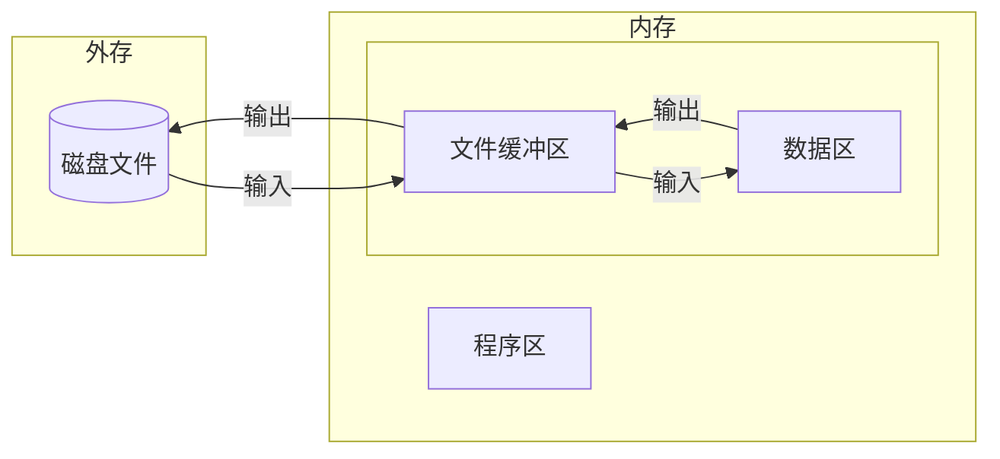

# 文件

## 文件的概述

### 文件和文件指针

#### 什么是文件

文件：存储在**外部存储介质**上相关**数据**的集合。

文件的存储特性：文件是一个**有序的数据序列**。C语言把文件作为**字符（字节）序列**处理，对文件的存储是以字符（字节）为单位进行的。

设备文件：把**输入输出设备**看作文件，把实际的物理设备抽象为逻辑文件，即为设备文件。

#### 文件的种类

按文件存储数据的形式

- 文本文件
- 二进制文件

按照对文件的处理方式

- 缓冲文件：利用缓冲文件系统处理的文件成为缓冲文件。
- 非缓冲文件：不为文件开辟缓冲区。

#### 缓冲文件和文件指针

系统对文件的处理过程：对文件进行输入/输出操作。



#### 文件类型指针

在**缓冲文件系统**中，对每个正在使用的文件都自动分配一个**FILE**类型的**结构体变量**，用于存放文件的有关信息，如文件号、文件状态、缓冲区地址和大小等。

在C语言中，无论对**磁盘文件**还是**设备文件**的**读/写**都要通过**FILE**类型的**结构体**变量进行。因此对于每个使用中的磁盘文件**必须**先**定义**一个FILE类型的**文件指针变量**并指向**此变量**。

```c
FILE *文件指针变量名;
FILE *fp;
```

#### 标准文件

| 标准文件         | 文件指针 | 系统指定 |
| ---------------- | -------- | -------- |
| 标准输入文件     | stdin    | 键盘     |
| 标准输出文件     | stdout   | 显示器   |
| 标准错误输出文件 | stderr   | 终端     |

### 文件的打开与关闭

#### 操作文件的一般步骤


- 打开文件：**建立**用户程序与文件的**联系**，**分配**文件缓冲区。
- 读写文件：读、写、追加、定位。
- 关闭文件：**切断**文件与程序的**联系**，**释放**文件缓冲区。

```c
#include <stdio.h>
```

#### 文件打开函数

```c
FILE *fp;
fp = fopen(文件名, 文件使用方式);
```

##### 参数

文件名：需要打开的文件名称（字符串）

文件使用方式：具有特定含义的符号

##### 返回值

文件打开成功，返回FILE文件指针；打开失败，返回NULL。

##### 三种基本打开方式

| 符号 | 使用方式 | 返回值                                         |
| ---- | -------- | ---------------------------------------------- |
| r/rb | 只读方式 | 若不存在，返回NULL。                           |
| w/wb | 只写方式 | 若不存在，建立一个新文件。若已存在，清空文件。 |
| a/ab | 追加方式 | 若不存在，返回NULL。若已存在，在末尾追加数据。 |

##### 检查文件是否打开成功

```c
if ((fp = fopen("filename", "r")) == NULL)
{
    printf("Cannot open file.\n");
    exit(0);
}
```

#### 文件关闭函数

```c
FILE *fp;
fclose(fp);
```

##### 参数

fp：已经打开的文件指针

##### 返回值

文件关闭成功，返回0；文件关闭失败，则返回非0值。

## 文本文件的读写

文本文件的读写按字符**先后顺序**进行，**读写指针**由系统**自动向后**移动。

### 文件的字符输入输出函数

#### 字符输出函数fputc()、putc()

```c
FILE *fp;
fputc(ch, fp);	
```

##### 参数

ch：需要输出的字符，可以是字符常量或字符变量；

fp：文件指针变量。

##### 返回值

成功返回写入的字符，失败返回EOF(-1)。

```c
// stdio.h
#define putc(c,f)  fputc((c),f)        // putc与fputc功能相同
#define putchar(c) putc((c),stdout)    // 标准文件中的putchar是fputc的特殊用法
```

#### 字符输入函数fgetc()、getc()

```c
FILE *fp;
ch = fgetc(fp);
```

##### 参数

fp：文件指针变量。

##### 返回值

ch：可以是字符变量或整型变量。

```c
// stdio.h
#define getc(f)   fgetc(f)       // getc与fgetc功能相同
#define getchar() getc(stdin)    // 标准文件中的getchar是fgetc的特殊用法
```

【例10.1】利用fputc和fgetc函数建立一个文本文件，并显示文件中的内容。

```c
#include <stdio.h>
main()
{
    FILE *fp;						// 定义一个文件指针变量fp
    int c;							// c为存放字符的变量
    char filename[40];				// filename用于存放数据文件名
    printf("filename: ");			// 提示输入磁盘文件名
    gets(filename);
    if ((fp = fopen(filename, "w")) == NULL)	// 测试打开文件是否成功
    {
        printf("Can\'t open the %s\n",filename);
        exit(0);
    }
    while ((c = getchar()) != EOF))	// 键盘文件结束标志：输入Ctrl+Z，显示^Z后回车
        putc(c,fp);					// 将键盘输入的字符写到文件中
    fclose(fp);						// 建立文件结束，关闭文件
    printf("outfile:\n");
    fp = fopen(filename, "r");		// 以读方式打开文件
    while ((c = getc(fp)) != EOF)	// 未读到结束标志时
        putchar(c);					// 在显示器显示读出的字符
    fclose(fp);						//读文件结束，关闭文件
}
```

#### 去掉windows下的回车符

```bash
$ dos2unix 文件名
```

### 文件的字符串输入输出函数

#### 字符串输入函数fgets()

```c
FILE *fp;
fgets(str,n,fp);
```

##### 参数

str：字符指针，可以是字符数组名或字符指针变量；

n：读取字符个数（n-1）；

fp：文件指针变量。

【例10.3】应用fputs和fgets函数，建立和读取文本文件。

```c
#include <stdio.h>
#include <string.h>
main()
{
    FILE *fp;						// 定义一个文件指针变量
    char filename[40], str[81];
    printf("filename: ");			// 提示输入磁盘文件名
    gets(filename);
    if ((fp = fopen(filename, "w")) == NULL)
    {
        printf("Can't open the %s\n", filename);
        exit(0);
    }
    while (strlen(gets(str)) > 0)	// 输入空串（仅回车）表示全部输入结束
    {
        fputs(str,fp);				// 写入文件
        fputc('\n',fp);				// 写入换行符
    }
    fclose(fp);
    printf("outfile:\n");
    fp = fopen(filename,"r");
    while ((fgets(str,81,fp)) != NULL)
        printf("%s", str);
    fclose(fp);
}
```

### 文件的格式输入输出函数

| 格式输入函数 | 格式输出函数 | 读写对象             |
| ------------ | ------------ | -------------------- |
| `scanf()`    | `printf()`   | 终端（键盘和显示器） |
| `fscanf()`   | `fprintf()`  | 磁盘文件             |

#### 文件的格式输出函数fprintf()

```c
FILE *fp;
fprintf(fp, 格式控制串, 地址表);
```

##### 返回值

输出操作成功，返回写入的字节数；否则返回EOF。  

#### 文件的格式输入函数fscanf()

```c
FILE *fp;
fscanf(fp, 格式控制串, 地址表);
```

##### 返回值

如果成功，返回实际读出的数据项个数，不包括分隔符。如果没有，则返回0。如果文件结束或读取失败，则返回EOF。

1、程序

要描述一下程序的功能

2、程序执行 （执行前和执行结果的截图）

```c
#include "stdio.h"
#include "string.h" 
main()
{    
    char infile[20], outfile[20], str[132];   
    FILE *fp1, *fp2;   
    strcpy(infile, "");  
    strcat(infile, "YWZ-line-cdp.lst");    
    fp1 = fopen(infile, "r"); 
    i = 1;   
    while (fscanf(fp1, "%d %d", &line[i], &cdp[i]) > 1)      
        i++;   
    strcpy(outfile, "");     
    strcat(outfile, "YWZ-line-CDP.lgd");    
    printf(" outline=%s\n", outline);  
    fp2 = fopen(outfile, "w");    
    fprintf(fp2, "  LIGNE %d=(%d-%d),\n", line1, cdp1, cpd2);
    fclose(fp1);
    fclose(fp2);
}
```


